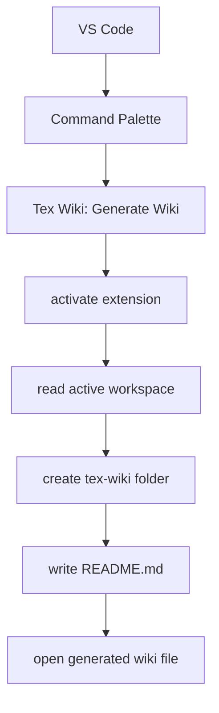

# 02 - VS Code Extension Fundamentals

## Core Concepts

### Extension Manifest

The `package.json` file is the extension manifest. It declares metadata, commands, activation events, contribution points, scripts, and dependencies.

Important fields:

- `name`
- `displayName`
- `description`
- `version`
- `publisher`
- `engines.vscode`
- `activationEvents`
- `main`
- `contributes`

### Activation

An extension is activated when VS Code detects one of its activation events.

Tex Wiki currently activates when this command runs:

```text
texWiki.generateWiki
```

### Commands

Commands are actions exposed to VS Code.

Tex Wiki currently contributes:

```text
Tex Wiki: Generate Wiki
```

### Extension Entry Point

The main extension logic starts in:

```text
src/extension.ts
```

The `activate` function registers commands and resources. The `deactivate` function is used for cleanup when needed.

## Initial Architecture



## Next Concepts To Learn

- File system APIs through `vscode.workspace.fs`
- Workspace folders
- Progress notifications
- Configuration settings
- Output channels
- Tree views
- Webviews
- Packaging with `vsce`
