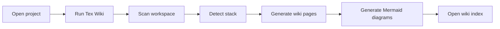

# 03 - Product Roadmap

## Product Goal

Tex Wiki should generate a rich wiki from the directory currently open in VS Code.

The generated wiki should help a developer understand:

- Project purpose
- Directory structure
- Main technologies
- Execution flow
- Architecture
- Setup process
- Deployment process
- Operational notes
- Glossary

## Version 0.0.1

Minimal extension scaffold.

Current behavior:

- Register one VS Code command.
- Detect the active workspace.
- Create a `tex-wiki/README.md` file.
- Add a starter Markdown structure.
- Add a Mermaid flow diagram.

## Next Milestone

Generate wiki content from the real workspace tree.

Expected behavior:

- Scan files and folders.
- Ignore noise folders such as `.git`, `node_modules`, `dist`, `build`, `out`, and `.vscode-test`.
- Generate a directory map.
- Generate a first architecture overview.
- Write multiple Markdown pages.

## Future Features

- Configurable output folder.
- Configurable ignore patterns.
- Stack detection.
- Mermaid architecture diagrams.
- Mermaid dependency diagrams.
- Summary by folder.
- GitHub-ready wiki export.
- Marketplace packaging.
- Documentation quality scoring.

## Product Flow

