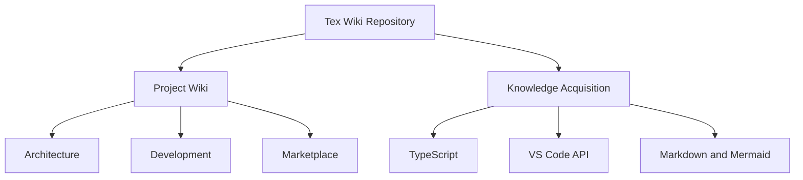

# Tex Wiki Documentation Wiki

This documentation area records the technical and product knowledge developed while building Tex Wiki.

The goal is to make the repository useful not only as source code, but also as a learning path for creating, evolving, packaging, and publishing VS Code extensions.

## Wiki Areas

- [Project Wiki](./project-wiki/README.md) - Product, architecture, development, roadmap, packaging, and examples.
- [Knowledge Acquisition](./knowledge-acquisition/README.md) - Learning path and study references needed to build the extension.

## Learning Tracks

1. Development environment
2. VS Code extension fundamentals
3. TypeScript and Node.js essentials
4. Markdown and Mermaid generation
5. Workspace scanning and file system APIs
6. Product architecture
7. Packaging and Marketplace publishing
8. Career and portfolio development

## Documentation Map

- [Project Wiki](./project-wiki/README.md)
- [Knowledge Acquisition](./knowledge-acquisition/README.md)
- [01 - Development Environment](./01-development-environment.md)
- [02 - VS Code Extension Fundamentals](./02-vscode-extension-fundamentals.md)
- [03 - Product Roadmap](./03-product-roadmap.md)
- [04 - Career and Portfolio Notes](./04-career-and-portfolio.md)

## Repository Purpose

Tex Wiki has two complementary purposes:

- Build a practical VS Code extension that generates rich project wikis.
- Document the learning process in a way that can support future extensions, articles, courses, demos, and portfolio material.

## Documentation Flow

