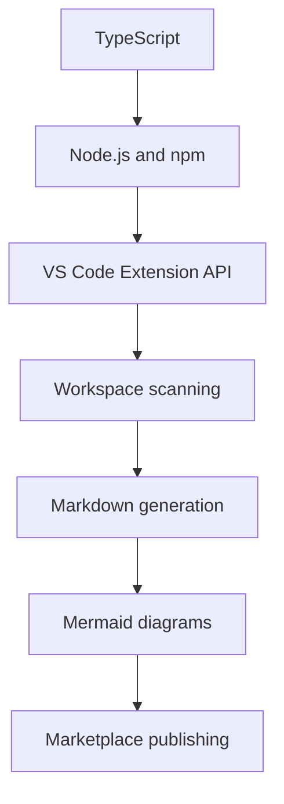

# Knowledge Acquisition

This folder organizes the knowledge needed to build Tex Wiki as a VS Code extension.

The goal is to create a guided learning path that supports both product development and professional growth.

## Wiki Sections

- [TypeScript](./typescript.md)
- [Node.js and npm](./nodejs-npm.md)
- [VS Code Extension API](./vscode-extension-api.md)
- [Markdown and Mermaid](./markdown-mermaid.md)
- [Git and GitHub](./git-github.md)
- [Marketplace Publishing](./marketplace.md)
- [Microsoft Learn and TypeScript](./microsoft-learn-typescript.md)

## Current Learning Sources

- [Microsoft Learn and TypeScript](./microsoft-learn-typescript.md)

## Suggested Study Order

1. [TypeScript](./typescript.md)
2. [Node.js and npm](./nodejs-npm.md)
3. [VS Code Extension API](./vscode-extension-api.md)
4. [Markdown and Mermaid](./markdown-mermaid.md)
5. [Git and GitHub](./git-github.md)
6. [Marketplace Publishing](./marketplace.md)

## Project Connection

Every learning topic should connect back to a practical Tex Wiki feature.

Example:

```text
TypeScript interfaces -> model wiki pages, folder summaries, scan results
VS Code commands -> expose Tex Wiki actions in the Command Palette
workspace.fs -> read directories and write generated Markdown files
Mermaid -> document architecture and flow diagrams
```

## Learning Flow


