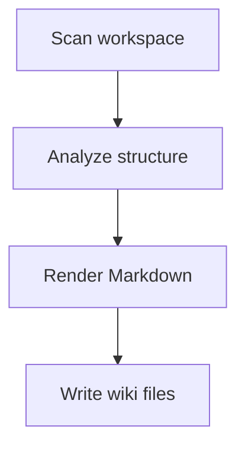

# Markdown and Mermaid

## Why It Matters

Tex Wiki generates documentation in Markdown and uses Mermaid to represent flows and architecture.

## Topics To Learn

- Markdown headings
- Lists
- Tables
- Relative links
- Code blocks
- Mermaid flowcharts
- Mermaid sequence diagrams

## Project Applications

- Generate wiki index pages.
- Generate directory maps.
- Generate architecture diagrams.
- Generate flow diagrams.

## Practice Tasks

1. Generate a Markdown table of scanned folders.
2. Generate a Mermaid flowchart for the extension lifecycle.
3. Add links between generated wiki pages.

## Mermaid Example

