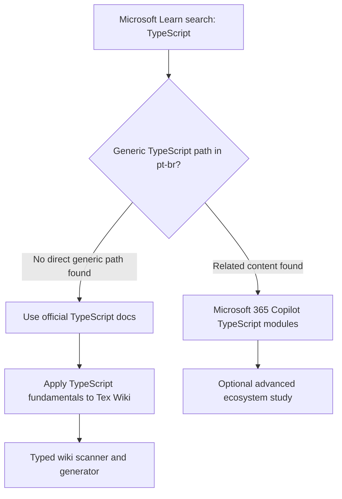

# Microsoft Learn and TypeScript

Research date: 2026-05-03

Requested page:

- <https://learn.microsoft.com/pt-br/training/browse/?terms=TypeScript>

## Findings

The Microsoft Learn catalog in `pt-br` currently returns TypeScript-related training content mainly around Microsoft 365 Copilot extensibility, not a generic beginner-to-advanced TypeScript path.

For TypeScript fundamentals, the Microsoft Learn training URL found for a generic TypeScript path redirects to the official TypeScript website:

- <https://www.typescriptlang.org/>

This is still relevant because TypeScript is a Microsoft-backed open-source language and the official site provides the handbook, playground, download instructions, and language documentation.

## Microsoft Learn Results In Portuguese

These items were found through the Microsoft Learn catalog API using `locale=pt-br` and the term `TypeScript`.

| Type | Title | Duration | Level | Link |
| --- | --- | ---: | --- | --- |
| Learning path | Expandir Microsoft 365 Copilot no TypeScript | 121 min | Beginner | <https://learn.microsoft.com/pt-br/training/paths/copilot-m365-extensibility-typescript/> |
| Module | Ligue Microsoft 365 Copilot aos seus dados externos em tempo real com plug-ins de extensão de mensagens criados com TypeScript e Visual Studio Code | 63 min | Beginner | <https://learn.microsoft.com/pt-br/training/modules/copilot-message-extension-plugins-typescript/> |
| Module | Integrar conteúdo externo com Microsoft 365 Copilot através de conectores Copilot criados com o TypeScript | 45 min | Beginner | <https://learn.microsoft.com/pt-br/training/modules/copilot-graph-connectors-typescript/> |

## Official TypeScript Resources

Use these resources for the core TypeScript learning path:

- TypeScript home: <https://www.typescriptlang.org/>
- TypeScript handbook: <https://www.typescriptlang.org/docs/handbook/intro.html>
- TypeScript playground: <https://www.typescriptlang.org/play>
- TSConfig reference: <https://www.typescriptlang.org/tsconfig>

## Relevance To Tex Wiki

For Tex Wiki, the TypeScript learning path should focus on:

- Basic types
- Interfaces and type aliases
- Function typing
- Async functions and promises
- Node.js module imports
- Strict mode
- Error handling
- Working with file and URI abstractions
- Modeling generated wiki structures

## Practical Study Tasks

1. Create interfaces for wiki pages, folders, scan results, and Mermaid diagrams.
2. Replace ad hoc Markdown generation with typed functions.
3. Add strict TypeScript checks before each release.
4. Use TypeScript types to document extension behavior.

## Mermaid View

