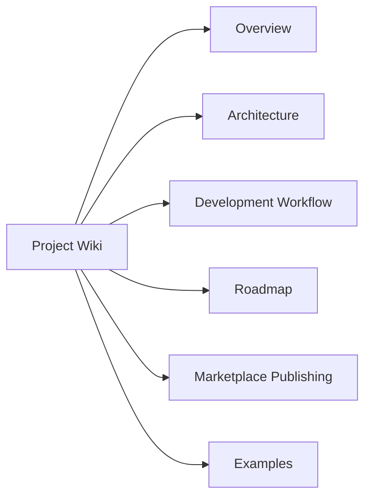

# Project Wiki

This wiki documents Tex Wiki as a product and as a VS Code extension project.

## Sections

- [Overview](./overview.md)
- [Architecture](./architecture.md)
- [Development Workflow](./development-workflow.md)
- [Roadmap](./roadmap.md)
- [Marketplace Publishing](./marketplace-publishing.md)
- [Examples](./examples.md)

## Product Purpose

Tex Wiki generates rich project documentation from the folder currently open in VS Code.

The generated wiki should include:

- Project overview
- Directory map
- Architecture notes
- Main flows
- Setup instructions
- Deployment notes
- Mermaid diagrams
- Glossary

## Wiki Structure

