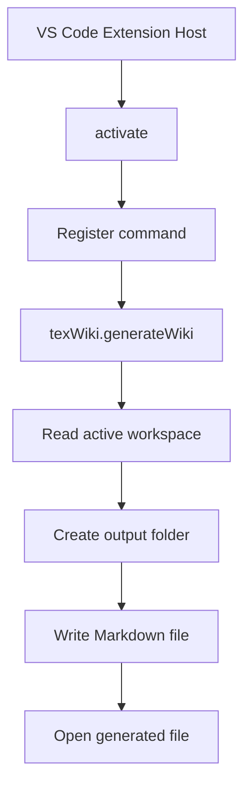
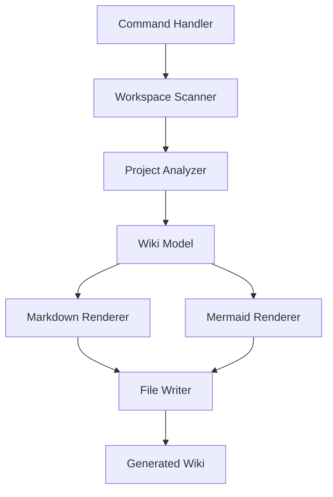

# Architecture

## Current Architecture

The extension starts with a command registered in `src/extension.ts`.



## Planned Architecture

Future implementation should separate the extension into clear modules.



## Suggested Source Structure

```text
src/
  extension.ts
  commands/
    generateWikiCommand.ts
  scanner/
    workspaceScanner.ts
    ignoreRules.ts
  wiki/
    wikiModel.ts
    markdownRenderer.ts
    mermaidRenderer.ts
  filesystem/
    wikiWriter.ts
```
