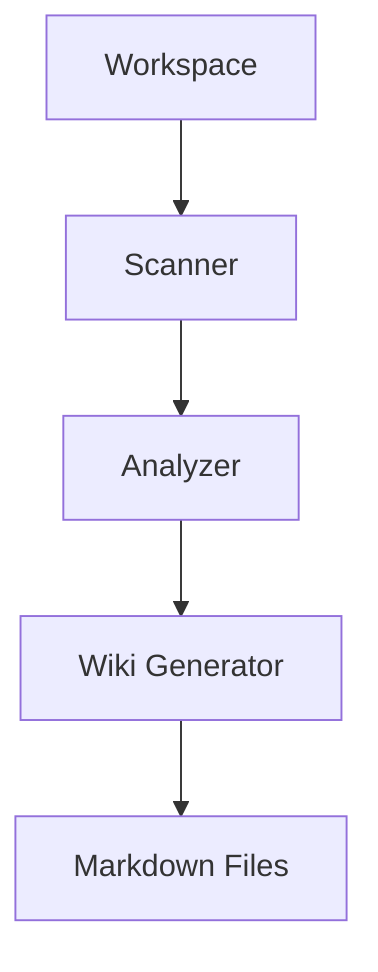

# Examples

## Generated Wiki Example

Future generated output:

```text
tex-wiki/
  README.md
  architecture.md
  directory-map.md
  flows.md
  setup.md
  deployment.md
  glossary.md
```

## Example Mermaid Flow



## Example Directory Map

```text
project/
  src/
  tests/
  docs/
  package.json
```
