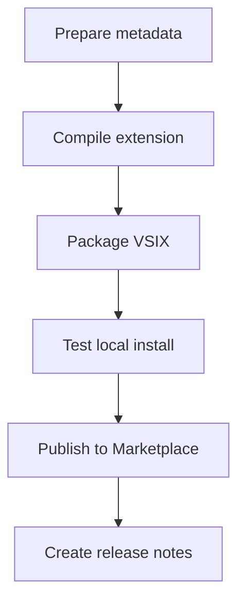

# Marketplace Publishing

## Goal

Publish Tex Wiki to the Visual Studio Marketplace.

## Required Items

- Marketplace publisher.
- Extension name and display name.
- README with usage examples.
- CHANGELOG.
- Icon.
- License.
- Clean package contents.
- Versioning strategy.

## Tooling

Install `vsce`:

```bash
npm install -g @vscode/vsce
```

Package:

```bash
vsce package
```

Publish:

```bash
vsce publish
```

## Publishing Flow


