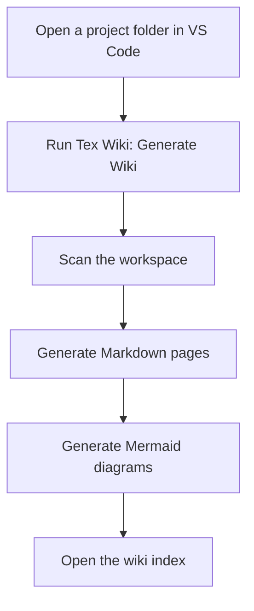

# Overview

Tex Wiki is a VS Code extension that creates a wiki from the active workspace.

## Current Status

The project currently has:

- Minimal VS Code extension scaffold.
- One command: `Tex Wiki: Generate Wiki`.
- Initial Markdown generation.
- Initial Mermaid diagram generation.
- GitHub repository structure.
- Documentation wiki and knowledge acquisition area.

## Target User

Tex Wiki is designed for developers, technical leads, architects, documentation maintainers, and teams that need to understand a project quickly.

## Main Value

Tex Wiki should reduce the time needed to create useful technical documentation for an existing codebase.

## Initial User Flow

